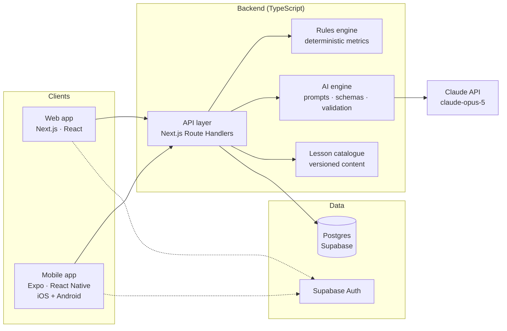
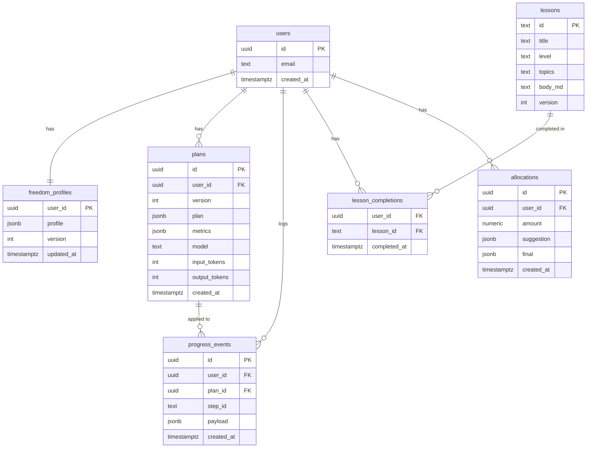
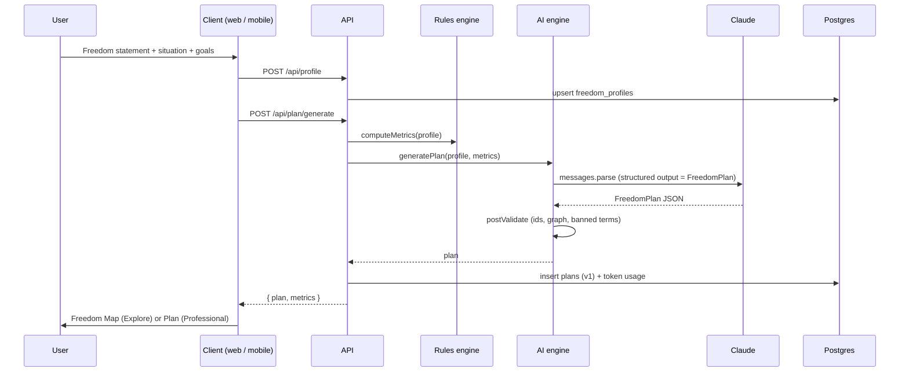
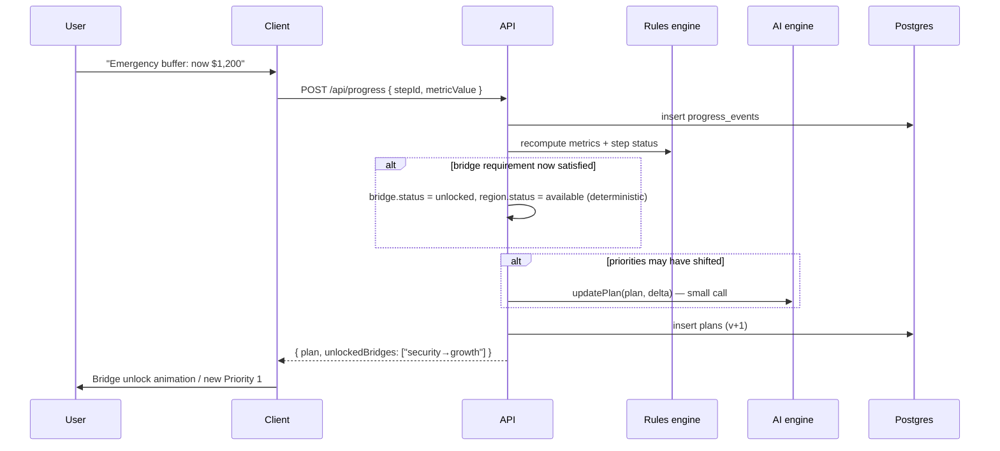
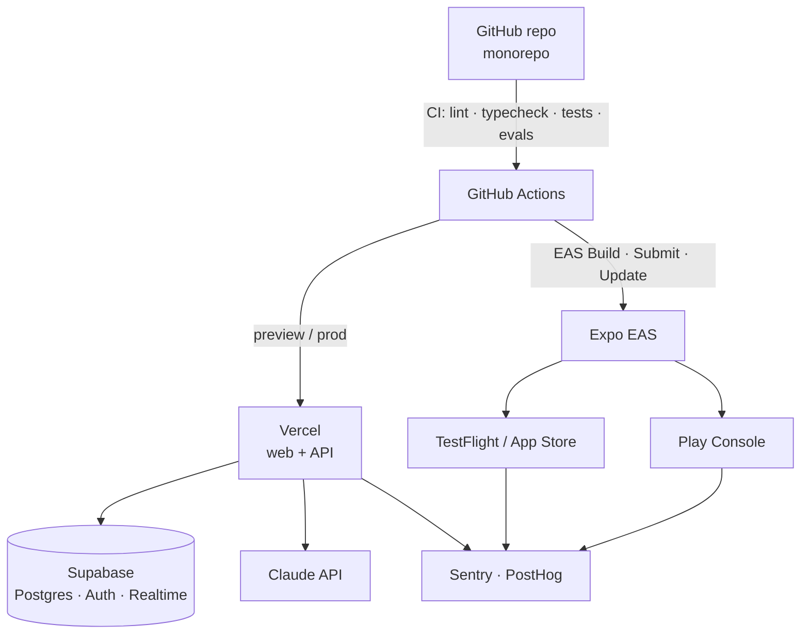

# 🕊️ Free Me — Technical Architecture

**Web app + iOS / Android app**

> Companion document: [FREE_ME_CONCEPT.md](FREE_ME_CONCEPT.md) — the product concept and hackathon vision.
> Development plan: [FREE_ME_DEVELOPMENT_PLAN.md](FREE_ME_DEVELOPMENT_PLAN.md) — phase-by-phase build instructions for Claude Code.
>
> This document describes (a) a lean **hackathon MVP** architecture and (b) the **product architecture** it grows into, covering the shared backend, the AI personalisation engine, the web app, and the native mobile apps.

---

## Contents

1. [Guiding Principles](#1-guiding-principles)
2. [Decisions at a Glance](#2-decisions-at-a-glance)
3. [System Overview](#3-system-overview)
4. [The Core Data Model — Freedom Profile & Freedom Plan](#4-the-core-data-model--freedom-profile--freedom-plan)
5. [The AI Engine](#5-the-ai-engine)
6. [Backend & API](#6-backend--api)
7. [Web App](#7-web-app)
8. [Mobile App (iOS / Android)](#8-mobile-app-ios--android)
9. [Rendering the Freedom Map — Shared Layout Logic](#9-rendering-the-freedom-map--shared-layout-logic)
10. [Monorepo Structure](#10-monorepo-structure)
11. [Key Flows](#11-key-flows)
12. [Security, Privacy & Compliance](#12-security-privacy--compliance)
13. [Infrastructure & DevOps](#13-infrastructure--devops)
14. [Hackathon MVP Cut](#14-hackathon-mvp-cut)
15. [Roadmap After the Hackathon](#15-roadmap-after-the-hackathon)

---

## 1. Guiding Principles

These five principles drive every decision below.

| Principle | What it means in practice |
|---|---|
| **One brain, two faces** | There is exactly one canonical object — the **Freedom Plan** (JSON). 🎮 Explore mode and 📊 Professional mode are two *renderers* of that object. Neither mode has its own logic. This is what makes *"Your journey doesn't change. How you experience it does."* literally true in code. |
| **The LLM reasons, the rules engine calculates** | Deterministic code computes every number (emergency-fund months, savings rate, months to goal, deposit target). The LLM receives those numbers and produces the *structure, priorities, and explanations*. The model never does arithmetic the user will rely on. |
| **Explainable by construction** | Every region, bridge and step in the plan carries a `why` field generated alongside it. The "Why?" button never triggers a guess after the fact — the reasoning already exists. |
| **Education, not advice** | The product explains, prioritises and teaches. It does not recommend specific products, securities or providers. This keeps the product on the right side of financial-advice regulation and is enforced in the prompt, the schema, and a validation pass. |
| **Share logic, not pixels** | Web and mobile share TypeScript packages (schemas, rules engine, map layout, API client, prompts). UI is built per platform so each feels native. |

---

## 2. Decisions at a Glance

| Area | Hackathon MVP | Product |
|---|---|---|
| **Web** | Next.js (App Router), React, TypeScript, Tailwind | Same |
| **Mobile** | Not built — the responsive web app opened on a phone | React Native + **Expo** (iOS & Android), sharing packages with web |
| **API** | Next.js Route Handlers (same deploy as web) | Same, with the AI engine extracted into a worker when load requires it |
| **Database** | Supabase Postgres (or in-memory for a pure demo) | Supabase Postgres + Row Level Security |
| **Auth** | None / anonymous session | Supabase Auth (email, Google, Sign in with Apple) |
| **AI** | Claude Opus 5 via `@anthropic-ai/sdk`, structured outputs | Same, plus prompt caching, effort tuning, evals, refusal fallbacks |
| **Map rendering** | SVG + Framer Motion, fixed template layout | Web: SVG (or `@xyflow/react`); Mobile: `react-native-svg` + Reanimated; Skia for polish |
| **Hosting** | Vercel + Supabase | Vercel + Supabase + Expo EAS (builds, OTA updates) |
| **Monorepo** | Optional — single Next.js app is fine | Turborepo + pnpm workspaces |

---

## 3. System Overview



**Request path in one sentence:** a client sends a Freedom Profile → the API computes metrics with the rules engine → the AI engine asks Claude for a structured Freedom Plan (using the profile, the metrics, and the lesson catalogue) → the plan is validated, stored, and returned → each client renders it in Explore or Professional mode.

The Claude API key lives **only** on the server. Clients never call Claude directly.

---

## 4. The Core Data Model — Freedom Profile & Freedom Plan

Everything hangs off two objects. Both are defined once in `packages/core` as Zod schemas, which gives you TypeScript types, runtime validation, **and** the JSON schema that constrains Claude's output — from a single definition.

### 4.1 Freedom Profile (input)

```ts
// packages/core/src/schema/profile.ts
import { z } from "zod";

export const Goal = z.object({
  id: z.string(),
  type: z.enum([
    "travel", "home", "education", "business", "security",
    "investing", "passive_income", "early_retirement", "other",
  ]),
  label: z.string(),                 // "Trip to Japan"
  targetAmount: z.number().optional(),
  targetDate: z.string().optional(), // ISO date
  priority: z.number().int().min(1), // 1 = most important
});

export const FreedomProfile = z.object({
  freedomStatement: z.string(),      // "I want to travel without worrying about money"
  age: z.number().int().min(13).max(100),
  country: z.string(),               // ISO 3166-1 alpha-2, e.g. "AU"
  currency: z.string(),              // "AUD"
  lifeStage: z.enum(["student", "early_career", "professional", "parent", "other"]),
  monthlyIncome: z.number().nonnegative(),
  monthlyExpenses: z.number().nonnegative(),
  savings: z.number().nonnegative(),
  debt: z.number().nonnegative(),
  goals: z.array(Goal).min(1),
  knowledge: z.enum(["beginner", "intermediate", "advanced"]),
  risk: z.enum(["conservative", "moderate", "high"]),
  priorities: z.string().optional(), // free text: "security before risk"
});
export type FreedomProfile = z.infer<typeof FreedomProfile>;
```

### 4.2 Computed Metrics (rules engine output)

```ts
// packages/core/src/rules/metrics.ts
export function computeMetrics(p: FreedomProfile) {
  const surplus = p.monthlyIncome - p.monthlyExpenses;
  const savingsRate = p.monthlyIncome > 0 ? surplus / p.monthlyIncome : 0;
  const emergencyMonths = p.monthlyExpenses > 0 ? p.savings / p.monthlyExpenses : null;
  const emergencyTarget = 3 * p.monthlyExpenses;          // baseline; tunable by life stage
  const debtToIncome = p.monthlyIncome > 0 ? p.debt / (p.monthlyIncome * 12) : null;

  const goalProjections = p.goals.map((g) => ({
    goalId: g.id,
    monthsToTarget:
      g.targetAmount && surplus > 0
        ? Math.ceil(Math.max(0, g.targetAmount - p.savings) / surplus)
        : null,
    onTrack: /* compare monthsToTarget with targetDate */ null,
  }));

  return { surplus, savingsRate, emergencyMonths, emergencyTarget, debtToIncome, goalProjections };
}
```

These numbers are computed **before** the AI call and passed to Claude as facts. They are also rendered directly in Professional mode, so the dashboard never shows a hallucinated figure.

### 4.3 Freedom Plan (the single source of truth)

```ts
// packages/core/src/schema/plan.ts
export const RegionType = z.enum([
  "foundation", "security", "growth",            // the spine
  "markets", "property", "business",             // exploration branches
  "digital_assets", "personal_goal",
  "freedom_city",                                // the destination
]);

export const Region = z.object({
  id: z.string(),
  type: RegionType,
  exploreTitle: z.string(),   // "Foundation Village"   (🎮)
  proTitle: z.string(),       // "Financial foundations" (📊)
  summary: z.string(),
  why: z.string(),            // why this region matters for THIS user
  relevance: z.number().int().min(1).max(5),   // ★ rating in path exploration
  status: z.enum(["locked", "available", "active", "complete"]),
  progress: z.number().min(0).max(1),
  stepIds: z.array(z.string()),
  lessonIds: z.array(z.string()),              // must exist in the lesson catalogue
  goalId: z.string().optional(),               // for personal_goal regions
});

export const Bridge = z.object({
  id: z.string(),
  from: z.string(),           // region id
  to: z.string(),             // region id
  status: z.enum(["locked", "unlocked"]),
  requirement: z.string(),    // "Complete 'Emergency buffer' step"
  relationship: z.string(),   // "Money into investments slows your deposit goal"
  why: z.string(),
});

export const Step = z.object({
  id: z.string(),
  regionId: z.string(),
  kind: z.enum(["learn", "save", "action", "review"]),
  title: z.string(),          // "Build your first $1,000 buffer"
  description: z.string(),
  why: z.string(),
  metric: z.object({          // optional progress bar
    label: z.string(),
    current: z.number(),
    target: z.number(),
    unit: z.string(),         // "AUD" | "months" | "%"
  }).optional(),
  status: z.enum(["todo", "in_progress", "done"]),
  order: z.number().int(),
});

export const FreedomPlan = z.object({
  version: z.number().int(),
  profileSummary: z.object({
    headline: z.string(),                    // "Travel-focused young saver"
    tags: z.array(z.string()),               // ["🎓 Student", "🌍 Travel-focused", ...]
  }),
  currentPriorityRegionId: z.string(),
  nextStepId: z.string(),
  regions: z.array(Region),
  bridges: z.array(Bridge),
  steps: z.array(Step),
  freedomCity: z.object({
    title: z.string(),                       // "🌴 Freedom City"
    pillars: z.array(z.string()),            // ["Flexible career", "Travel", ...]
    narrative: z.string(),
  }),
  disclaimers: z.array(z.string()),
});
export type FreedomPlan = z.infer<typeof FreedomPlan>;
```

**How the two modes consume it:**

| Plan field | 🎮 Explore renders it as… | 📊 Professional renders it as… |
|---|---|---|
| `regions` | Villages / districts on the map, with fog on `locked` | Rows in a "Your paths" table with ★ relevance |
| `bridges` | Drawn connections; unlock animation on status change | "Dependencies" list under each priority |
| `steps` | Quests inside a region | Prioritised checklist with progress bars |
| `currentPriorityRegionId` | Camera focus / highlighted region | "Current priority" card |
| `nextStepId` | "Your next step" banner | Priority 1 |
| `freedomCity` | The destination city at the end of the map | "Your definition of freedom" header |
| `metrics` (rules engine) | Progress rings | "Current position" stat tiles |

---

## 5. The AI Engine

The AI engine is a TypeScript package (`packages/ai`) with one function per capability. Each function builds a prompt, calls Claude with a **structured output schema**, validates the result, and returns typed data.

### 5.1 Capabilities

| Capability | Trigger | Input | Output | Notes |
|---|---|---|---|---|
| **Profile synthesis** | Onboarding complete | Profile + metrics | `profileSummary` (headline, tags) | Can be folded into plan generation |
| **Plan generation** | Onboarding complete; major profile change | Profile + metrics + lesson catalogue summary | Full `FreedomPlan` | The big call. ~10–30 s. |
| **Plan update** | Progress event, new goal | Existing plan + delta | Patched `FreedomPlan` | Send the current plan and ask for changes only, to keep it stable |
| **"Why?"** | Button tap | Plan item + profile + metrics | Short explanation | Usually already on the item; this is a *deeper* explanation on demand |
| **Allocate money** | "I have $X to allocate" | Amount + plan + metrics | `[{bucket, amount, reason}]` that sums to X | Sum is verified in code; the model can be asked to retry if it doesn't |
| **Personalised lesson** | User opens a lesson | Lesson body + knowledge level + goals | Rewritten lesson with a user-specific example | Stream this — it's read as it's generated |
| **Path relevance** | Exploration screen | Profile + metrics | ★ ratings + one-line reason per path | Part of plan generation via `region.relevance` |

### 5.2 Model and API choices

| Choice | Value | Why |
|---|---|---|
| Model | **`claude-opus-5`** | Best reasoning quality for a plan users will act on; 1M context; $5 / $25 per M input / output tokens |
| Thinking | Adaptive (the default on Opus 5 — omit the parameter) | Claude decides how much to think per request |
| Effort | `output_config.effort`: `high` for plan generation, `low`–`medium` for "why" and lesson rewrites | Effort, not model-swapping, is the cost lever; keeps one cache namespace |
| Output shape | Structured outputs: `output_config.format` built from the Zod schema with `zodOutputFormat()` and `client.messages.parse()` | Response is guaranteed to match `FreedomPlan`; no JSON-repair code |
| Caching | `cache_control` on the system prompt and the lesson catalogue block | Both are identical across users; the profile goes *after* the cache breakpoint |
| Streaming | For lesson personalisation and long explanations | Perceived latency; plan generation can be non-streaming with a "building your world" screen |
| Refusals | Check `stop_reason === "refusal"`; enable server-side fallbacks (`betas: ["server-side-fallback-2026-07-01"]`, `fallbacks: "default"`) | Rare for this domain, but a user must never see a blank map |

### 5.3 Prompt structure (plan generation)

```
SYSTEM  (cached — identical for every user)
  ├─ Role: Free Me personalisation engine
  ├─ Product rules
  │    • education, not advice: never name products, tickers, providers
  │    • every region/bridge/step must have a plain-language `why`
  │    • use ONLY the provided metrics for numbers; never invent figures
  │    • lessonIds must come from the catalogue
  │    • Explore titles: elegant, not childish; Pro titles: plain
  │    • tone: warm, direct, no jargon for beginners
  ├─ Map grammar: spine (foundation→security→growth) then branches; when to
  │    lock a branch; how bridges express trade-offs between goals
  └─ Lesson catalogue summary: [{id, title, level, topics}]   ← cache breakpoint

USER
  └─ { profile, metrics }   (JSON)

OUTPUT  → FreedomPlan (structured output; validated with Zod)
```

### 5.4 Reference implementation (server-side)

```ts
// packages/ai/src/generatePlan.ts
import Anthropic from "@anthropic-ai/sdk";
import { zodOutputFormat } from "@anthropic-ai/sdk/helpers/zod";
import { FreedomPlan, FreedomProfile, computeMetrics } from "@free-me/core";
import { PLAN_SYSTEM_PROMPT, catalogueSummary } from "./prompts";

const client = new Anthropic(); // reads ANTHROPIC_API_KEY — server only

export async function generatePlan(profile: FreedomProfile) {
  const metrics = computeMetrics(profile);

  const response = await client.messages.parse({
    model: "claude-opus-5",
    max_tokens: 16000,
    system: [
      { type: "text", text: PLAN_SYSTEM_PROMPT },
      { type: "text", text: catalogueSummary(), cache_control: { type: "ephemeral" } },
    ],
    messages: [
      { role: "user", content: JSON.stringify({ profile, metrics }) },
    ],
    output_config: {
      effort: "high",
      format: zodOutputFormat(FreedomPlan),
    },
  });

  if (response.stop_reason === "refusal" || !response.parsed_output) {
    throw new PlanGenerationError(response.stop_reason);
  }

  return postValidate(response.parsed_output, metrics); // §5.5
}
```

### 5.5 Validation after the model

Structured outputs guarantee the *shape*. A small deterministic pass guarantees the *semantics*:

- every `stepIds` / `lessonIds` / bridge `from` / `to` references an existing id;
- every `lessonId` exists in the catalogue;
- the graph is acyclic and every region is reachable from `foundation`;
- `nextStepId` belongs to `currentPriorityRegionId`;
- no banned terms (tickers, product names, "you should buy") — regex list;
- allocation amounts sum to the requested total (for the allocate capability).

On failure, retry once with the validation errors appended to the prompt; on second failure, fall back to a template plan generated purely by the rules engine (never show an empty map).

### 5.6 Cost and latency envelope

| Call | Approx. tokens (in / out) | Approx. cost on Opus 5 | Latency |
|---|---|---|---|
| Plan generation | 5k / 8–15k *(measured)* | ~$0.20–0.40 at effort `high` (the 5k system+catalogue prefix is cache-read after the first call) | 100–200 s *(measured at effort `high`; use `medium` for a faster first map)* |
| "Why?" (deep) | 2k / 0.3k | ~$0.02 | 2–5 s |
| Allocation | 2.5k / 0.4k | ~$0.02 | 3–6 s |
| Lesson rewrite | 3k / 1k | ~$0.04 | streamed |

A user costs on the order of **$0.20–0.40 for onboarding** and cents per interaction afterwards.

### 5.7 Evaluation

Keep a folder of **golden profiles** (Sarah; User A; User B; a debt-heavy profile; a high-income profile; an edge case with zero income). A test suite generates a plan for each and asserts structural expectations — e.g. *Sarah's plan has a `personal_goal` region for Japan, `property` is locked with relevance ≤ 2, and `nextStep` belongs to `security`*. Run this whenever the prompt or schema changes. It is also your demo safety net: the golden plans are cached JSON you can show if the network fails on stage.

---

## 6. Backend & API

### 6.1 Shape

For the hackathon and the first product release, the API is **Next.js Route Handlers** deployed with the web app on Vercel. This avoids a second service. The AI engine lives in `packages/ai` so it can be moved into a worker (queue-driven) later without rewriting it.

Why not Python / FastAPI? The AI engine benefits from sharing the Zod schemas with both clients; keeping everything in TypeScript means one schema, one type system, one validation layer. If the team is more comfortable in Python, a FastAPI service with Pydantic models is a fine substitute — but then the schema must be maintained twice (Pydantic + Zod) or generated from JSON Schema.

### 6.2 Endpoints

| Method | Path | Purpose |
|---|---|---|
| `POST` | `/api/profile` | Create / replace the user's Freedom Profile |
| `POST` | `/api/plan/generate` | Generate a Freedom Plan (returns plan; MVP does it synchronously) |
| `GET` | `/api/plan` | Latest plan + metrics |
| `POST` | `/api/plan/why` | `{ itemType, itemId }` → deeper explanation |
| `POST` | `/api/allocate` | `{ amount }` → suggested allocation |
| `POST` | `/api/progress` | `{ stepId, status \| metricValue }` → updated plan (bridges may unlock) |
| `GET` | `/api/lessons/:id` | Lesson body (catalogue) |
| `POST` | `/api/lessons/:id/personalise` | Streams a rewritten lesson for this user |
| `GET` | `/api/demo/:name` | Pre-generated golden plan (hackathon demo only) |

All responses are validated with the shared Zod schemas on the way out and on the way in on the client.

### 6.3 Database (Postgres on Supabase)



- The plan is stored as **JSONB**, versioned. No normalised node tables — the plan is a document that both clients render as a whole.
- **Row Level Security** on every user-owned table (`user_id = auth.uid()`), so clients can read their own plan straight from Supabase if you ever want to bypass the API for reads.
- `plans.model`, `input_tokens`, `output_tokens` give you cost monitoring for free.

### 6.4 Background work (product phase)

Plan generation is the only slow operation. When you need it asynchronous:

1. `POST /api/plan/generate` enqueues a job and returns `202 { jobId }`.
2. A worker (Vercel background function, Inngest, or Trigger.dev) runs `generatePlan`.
3. The client subscribes to the `plans` row via Supabase Realtime (or polls) and animates the map in when it lands.

---

## 7. Web App

### 7.1 Stack

| Concern | Choice |
|---|---|
| Framework | **Next.js** (App Router), React, TypeScript |
| Styling | Tailwind CSS + shadcn/ui components; design tokens in `packages/tokens` |
| Animation | Framer Motion (layout animations for the mode switch, bridge unlocks, progress) |
| Server state | TanStack Query (plan, lessons) |
| Client state | Zustand — `mode: "explore" \| "professional"`, selected region, onboarding draft (persisted to `localStorage`) |
| Charts (Pro mode) | Recharts, or hand-rolled SVG progress bars |
| Forms | React Hook Form + the shared Zod schema |
| PWA | `next-pwa` / manifest + service worker so the hackathon demo installs on a phone |

### 7.2 Route structure

```
app/
  (marketing)/page.tsx            landing: "What does freedom mean to you?"
  onboarding/
    freedom/page.tsx              step 1 — freedom statement
    situation/page.tsx            step 2 — income, expenses, savings, goals, knowledge, risk
    generating/page.tsx           step 3 — "building your world" (progress + streamed profile tags)
  map/page.tsx                    step 4 — Freedom Map (Explore) / Plan (Professional) with toggle
  map/[regionId]/page.tsx         step 5 — region detail: why, steps, lessons
  lessons/[id]/page.tsx           personalised lesson (streamed)
  allocate/page.tsx               "I have money to allocate"
  api/...                         route handlers (§6.2)
```

### 7.3 The mode toggle

```tsx
// apps/web/components/plan-view.tsx
export function PlanView({ plan, metrics }: { plan: FreedomPlan; metrics: Metrics }) {
  const mode = useUiStore((s) => s.mode);
  return (
    <AnimatePresence mode="wait">
      {mode === "explore"
        ? <ExploreMap key="explore" plan={plan} metrics={metrics} />
        : <ProfessionalPlan key="pro" plan={plan} metrics={metrics} />}
    </AnimatePresence>
  );
}
```

Both views receive the identical `plan` object. The toggle is a one-line state change — which is exactly the point you make on stage.

### 7.4 Explore map rendering (web)

- **Hackathon:** a single `<svg>` with regions placed by the shared layout function (§9), Framer Motion for entrance / unlock animations, `locked` regions rendered with a fog overlay. A pan / zoom wrapper (`react-zoom-pan-pinch`) makes it feel like a world.
- **Product:** `@xyflow/react` (React Flow) if the graph becomes user-editable (adding bridges, dragging goals); PixiJS / WebGL only if you want terrain, parallax, or particle effects. Do not start there.

### 7.5 Professional dashboard rendering

Sections in order: **Current position** (stat tiles from `metrics`) → **Current priority** (region card + `why`) → **Next steps** (steps sorted by `order`, progress bars from `step.metric`) → **Your paths** (regions table with ★ `relevance`) → **Learning** (lessons for the active region) → **Your definition of freedom** (`freedomCity`).

---

## 8. Mobile App (iOS / Android)

### 8.1 Recommendation: React Native with Expo

**Why:** the whole point of the architecture is that the plan, the rules engine, the map layout, and the API client are TypeScript. Expo lets the mobile app import those packages unchanged, ship to both stores from one codebase, push over-the-air updates for non-native changes, and be built by the same team that builds the web app.

| Option | Code sharing with web | Native fidelity | Team cost | Verdict |
|---|---|---|---|---|
| **Expo / React Native** | Schemas, rules, layout, API client, prompts — all shared | High (Reanimated, Skia, native navigation) | One TS team | ✅ **Recommended** |
| Expo *universal* app (RN + `react-native-web`, one codebase for web too) | Everything including UI | High on mobile; web feels app-like | Lowest | Good alternative if you prefer one codebase over a Next.js site; keep the marketing site separate |
| Flutter | None (Dart) — schema must be duplicated | High; excellent canvas for the map | Separate team | Only if the team is already Flutter-native |
| Native Swift + Kotlin | None | Highest | Two teams, two codebases | Not justified at this stage |

### 8.2 Stack

| Concern | Choice |
|---|---|
| Framework | Expo (latest SDK), **Expo Router** (file-based navigation, mirrors the web route structure) |
| Map rendering | `react-native-svg` for regions, bridges and paths; `react-native-reanimated` + `react-native-gesture-handler` for pan / zoom / unlock animations; `@shopify/react-native-skia` for glow, fog and terrain effects when you want them |
| UI | NativeWind (Tailwind classes in RN) so tokens match web; Expo Image; Expo Haptics on bridge unlock |
| Server / client state | TanStack Query + Zustand — same as web (identical hooks in `packages/api-client`) |
| Auth | Supabase Auth; tokens in `expo-secure-store`; **Sign in with Apple** is mandatory on iOS if any third-party login is offered |
| Offline | Last plan + metrics cached in MMKV (`react-native-mmkv`); progress updates queued and replayed when online; the map always opens instantly |
| Notifications | `expo-notifications` for nudges ("You're 80 % of the way to your emergency buffer") and bridge unlocks; scheduled server-side from progress events |
| Charts (Pro mode) | Victory Native or Skia-drawn bars |
| Builds & releases | **EAS Build** (cloud builds for iOS / Android), **EAS Submit** (TestFlight / Play Console), **EAS Update** (OTA JS updates) |
| Crash / analytics | Sentry (`@sentry/react-native`), PostHog |

### 8.3 Screen structure

```
app/
  (onboarding)/freedom.tsx
  (onboarding)/situation.tsx
  (onboarding)/generating.tsx
  (tabs)/
    map.tsx            Explore / Professional with a segmented-control toggle in the header
    learn.tsx          "Your next learning step" + lesson list
    allocate.tsx       "I have money to allocate"
    profile.tsx        Freedom Profile, edit → regenerate
  region/[id].tsx      modal sheet: why, steps, lessons
  lesson/[id].tsx      streamed personalised lesson
```

### 8.4 Mobile-specific product notes

- **The map is the home screen.** Cold start should render the cached plan in < 1 s and refresh in the background.
- **Explore vs Professional** persists per device (MMKV) so a user who prefers the dashboard is never shown the world first.
- **Store review:** describe the app as *financial education / planning*, not *advice*. Complete Apple's privacy nutrition labels and Google's Data Safety form — you collect financial information, so declare it. Both stores scrutinise finance apps more closely; keep the disclaimer visible in-app.
- **Accessibility:** every map region has an accessible label and a list fallback (Professional mode *is* that fallback — another reason it earns its place).

---

## 9. Rendering the Freedom Map — Shared Layout Logic

The map layout is **deterministic code in `packages/core`**, not something the LLM decides. Both clients import the same function and receive `{ x, y }` positions in an abstract coordinate space; each platform scales to its canvas.

```ts
// packages/core/src/layout/freedomMap.ts
export function layoutFreedomMap(plan: FreedomPlan): MapLayout {
  // 1. The spine: foundation → security → growth, laid out top-to-bottom (mobile)
  //    or left-to-right (web, wide viewports) — caller passes orientation.
  // 2. Exploration branches fan out from `growth`, ordered by relevance (highest closest).
  // 3. personal_goal regions attach next to the region their goal depends on.
  // 4. freedom_city is placed at the far end; all branches curve towards it.
  // 5. Bridges become cubic Bézier paths between region anchors.
  // Returns: { regions: [{id, x, y, w, h}], bridges: [{id, path: string}] }
}
```

For the hackathon, use fixed slots per `RegionType` (a template). If you later allow arbitrary graphs, swap the body for `@dagrejs/dagre` (auto-layout) without touching either client — the return type stays the same.

---

## 10. Monorepo Structure

```
free-me/
├─ apps/
│  ├─ web/                 Next.js app + API route handlers
│  └─ mobile/              Expo app (iOS / Android)
├─ packages/
│  ├─ core/                Zod schemas (profile, plan), rules engine, map layout, pure TS
│  ├─ ai/                  prompts, generatePlan / explain / allocate / personaliseLesson, validation
│  ├─ api-client/          typed fetch hooks (TanStack Query) shared by web and mobile
│  ├─ content/             lesson catalogue (Markdown + front-matter), seed script
│  ├─ tokens/              colours, spacing, typography — consumed by Tailwind and NativeWind
│  └─ config/              shared tsconfig, eslint, prettier
├─ supabase/               migrations, RLS policies, seed
├─ evals/                  golden profiles + snapshot tests for the AI engine
├─ turbo.json
└─ pnpm-workspace.yaml
```

Tooling: **pnpm** workspaces + **Turborepo** for task caching. `packages/core` and `packages/ai` have zero React dependencies, so they run in the API, in tests, and in both clients.

---

## 11. Key Flows

### 11.1 Onboarding → Freedom Map



### 11.2 Progress → world evolves



Unlocks are **rule-based** (fast, predictable, no AI needed); re-prioritisation is the only reason to call the model again, and it can be deferred.

### 11.3 "I have money to allocate"

1. Client sends `{ amount }`.
2. API assembles `{ amount, plan, metrics }` and calls `allocate()` with a schema that forces `buckets[].amount` to be integers with reasons.
3. Code checks the sum equals `amount` (retry once if not).
4. Client shows the suggestion as editable sliders; the user's final split is saved (`allocations.final`) and can become progress events.

---

## 12. Security, Privacy & Compliance

| Topic | Approach |
|---|---|
| **API keys** | `ANTHROPIC_API_KEY` and Supabase service keys exist only in server environment variables. The mobile app and browser use the Supabase **anon** key plus RLS. |
| **PII minimisation** | Store only what the plan needs. No bank credentials, account numbers, or transaction data in the MVP. Consider storing income / expenses as buckets rather than exact figures where precision isn't needed. |
| **Data in transit / at rest** | TLS everywhere; Supabase encrypts at rest. Secure storage on device (`expo-secure-store` for tokens, MMKV encrypted for the plan cache). |
| **What is sent to Claude** | Profile + metrics only — no email, name, or identifiers. Log token counts, not prompt contents, in production. |
| **Prompt injection** | The free-text `freedomStatement` and `priorities` are user content. They are passed inside a JSON `user` message, never concatenated into the system prompt, and the structured-output schema limits what the model can return. |
| **Abuse / cost control** | Rate-limit `plan/generate` per user (e.g. 3 / day); cache plans; require auth for anything that calls the model in production. |
| **Financial-advice regulation** | This is the important one. In Australia, *personal* financial advice requires an AFS licence; *general* information and education do not. Free Me stays on the education side: no product or security recommendations, no "you should buy X", prominent "educational, not financial advice" disclaimers in both modes, and the `disclaimers` field in every plan. Equivalent lines exist in the UK, EU, US and elsewhere. Get a legal review before public launch. |
| **Age** | Target users may be under 18. Don't collect more than needed, and check store age-rating requirements. |
| **Bank connectivity (future)** | If you later import transactions, use an accredited data provider (in Australia, the Consumer Data Right via Basiq / Frollo; Plaid elsewhere). Never handle bank credentials yourself. |

---

## 13. Infrastructure & DevOps



| Concern | Choice |
|---|---|
| Environments | `dev` (local Supabase via CLI), `preview` (Vercel preview + Supabase branch), `prod` |
| CI | GitHub Actions: `pnpm turbo lint typecheck test`; `evals` run on prompt/schema changes |
| Web deploy | Vercel, automatic from `main` |
| Mobile deploy | EAS Build on tag; EAS Update for JS-only fixes; store submission via EAS Submit |
| Secrets | Vercel / EAS environment variables; never in the repo |
| Observability | Sentry (errors, both platforms), PostHog (funnel: onboarding → map → toggle → lesson), a simple cost dashboard from `plans.input_tokens` / `output_tokens` |
| Backups | Supabase point-in-time recovery |

---

## 14. Hackathon MVP Cut

Build the smallest thing that produces the WOW moment reliably.

### 14.1 Scope

| In | Out |
|---|---|
| Web app only (responsive; open on a phone for the "mobile" moment) | Native mobile app |
| Onboarding (2 screens) → generating screen → map → region detail → toggle | Auth, accounts, multi-user |
| One real Claude call generating the full `FreedomPlan` with structured outputs | Plan updates, background jobs |
| "Why?" on regions/steps (from the plan's `why`; one live deep-dive call for the demo) | Allocation feature (show it as a mock screen if time allows) |
| 6–10 hand-written lessons in the catalogue; one live personalised rewrite | Full curriculum |
| Fixed-template SVG map with Framer Motion | Pan/zoom world, terrain, React Flow |
| Golden plans cached as JSON for Sarah, User A, User B | — |

### 14.2 Build order (≈ 36–48 h)

| Hours | Milestone |
|---|---|
| 0–3 | Repo, Next.js + Tailwind, `packages/core` schemas, rules engine with tests |
| 3–8 | `generatePlan` with structured outputs; run it on the three golden profiles; commit the JSON |
| 8–16 | Explore map (SVG + layout function + animations) driven by golden JSON |
| 16–22 | Professional dashboard from the same JSON; toggle with animated transition |
| 22–28 | Onboarding screens → live generation → map |
| 28–34 | Region detail: why, steps, lessons; one streamed personalised lesson |
| 34–40 | Polish: fog on locked regions, bridge unlock demo (button that fires a progress event), disclaimers |
| 40–48 | Demo script, fallback to cached JSON, pitch deck, rehearsal |

### 14.3 Team split (4 people)

| Person | Owns |
|---|---|
| **Map / Explore** | SVG map, layout, animations, region detail |
| **Dashboard / Onboarding** | Forms, generating screen, Professional view, toggle |
| **Backend / AI** | Schemas, rules engine, prompts, `generatePlan`, validation, API routes, golden plans |
| **Content / Design / Pitch** | Lesson catalogue, visual style (elegant, not cartoon), copy, disclaimers, pitch |

### 14.4 Demo risk mitigation

- **Network fails** → `GET /api/demo/sarah` serves the cached golden plan; the UI is identical.
- **Model is slow** → the generating screen shows streamed profile tags while the plan builds; set a 45 s timeout that falls back to the golden plan.
- **Validation fails** → retry once, then fall back to the rules-engine template plan.
- **Judge asks "isn't this just ChatGPT?"** → open Professional mode and point to the metrics that are computed, the `why` fields on every item, and the schema-constrained output. The model is a structured personalisation engine, not a chat window.

---

## 15. Roadmap After the Hackathon

| Phase | Focus | Key architecture additions |
|---|---|---|
| **1. Web product** | Accounts, plan persistence, progress, allocation, evals, legal review | Supabase Auth + RLS, `plans` versioning, cost monitoring, disclaimers review |
| **2. Mobile** | Expo app on iOS / Android sharing `packages/*` | Offline plan cache, push nudges, EAS pipeline, store listings |
| **3. Deeper personalisation** | Plan updates from progress, adaptive lesson sequencing, "what if" bridges (invest more vs. deposit sooner) | Async generation via queue, plan diffing, scenario metrics in the rules engine |
| **4. Real data** | Optional transaction import (CDR / Open Banking) to auto-update savings and expenses | Accredited data provider integration, consent flows, data retention policies |
| **5. Community & content** | Broader lesson catalogue, multi-country rules (superannuation, HECS-HELP, ISAs, 401(k)…) | Country modules in the rules engine; catalogue tagging by jurisdiction |

---

*One brain, two faces: the Freedom Plan is the product. Everything else is a way of looking at it.*
