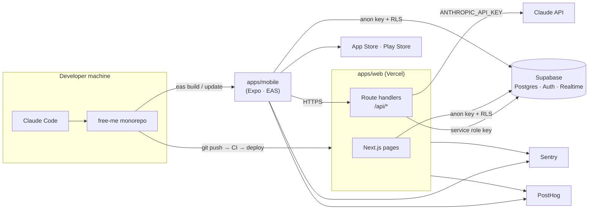
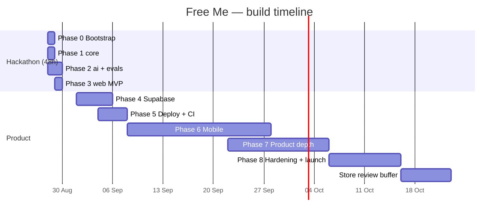

# 🚀 Free Me — Development Plan with Claude Code

**How to build the full solution — web + iOS / Android — phase by phase, using Claude Code as the implementation partner.**

> Companion documents:
> - [FREE_ME_CONCEPT.md](FREE_ME_CONCEPT.md) — what we're building and why (the product spec).
> - [FREE_ME_ARCHITECTURE.md](FREE_ME_ARCHITECTURE.md) — how it's structured (the technical spec).
>
> This plan turns those two documents into an ordered set of **Claude Code sessions**. Each session has a copy-paste prompt, the integration steps a human must do first, the commands to verify the result, and a definition of done.

---

## Contents

1. [How to Use This Plan](#1-how-to-use-this-plan)
2. [Prerequisites & Accounts](#2-prerequisites--accounts)
3. [Integration Map](#3-integration-map)
4. [Claude Code Setup for This Project](#4-claude-code-setup-for-this-project)
5. [Phase 0 — Bootstrap the Monorepo](#5-phase-0--bootstrap-the-monorepo)
6. [Phase 1 — `packages/core`: Schemas, Rules Engine, Map Layout](#6-phase-1--packagescore-schemas-rules-engine-map-layout)
7. [Phase 2 — `packages/ai`: The AI Engine + Evals](#7-phase-2--packagesai-the-ai-engine--evals)
8. [Phase 3 — `apps/web`: The Web App](#8-phase-3--appsweb-the-web-app)
9. [Hackathon Stop Line](#9-hackathon-stop-line)
10. [Phase 4 — Supabase: Persistence & Auth](#10-phase-4--supabase-persistence--auth)
11. [Phase 5 — Deploy Web + CI + Observability](#11-phase-5--deploy-web--ci--observability)
12. [Phase 6 — `apps/mobile`: iOS & Android](#12-phase-6--appsmobile-ios--android)
13. [Phase 7 — Product Depth: Progress, Allocation, Adaptive Learning](#13-phase-7--product-depth-progress-allocation-adaptive-learning)
14. [Phase 8 — Hardening & Launch](#14-phase-8--hardening--launch)
15. [Timeline](#15-timeline)
16. [Definition of Done — Whole Solution](#16-definition-of-done--whole-solution)
17. [Appendix A — Reusable Prompt Snippets](#17-appendix-a--reusable-prompt-snippets)
18. [Appendix B — Troubleshooting](#18-appendix-b--troubleshooting)

---

## 1. How to Use This Plan

### The unit of work is a Claude Code session

Every phase below is broken into sessions. A session is one focused piece of work with a clear finish line. The loop for each session is always the same:

```
 ┌──────────────────────────────────────────────────────────────────────┐
 │ 1. HUMAN SETUP   create the account / key / service the session needs │
 │ 2. START         `claude` in the repo root, paste the session prompt   │
 │ 3. PLAN FIRST    Claude proposes a plan (plan mode) → you approve      │
 │ 4. IMPLEMENT     Claude writes code + tests, runs typecheck/tests      │
 │ 5. VERIFY        you run the phase's verification commands yourself    │
 │ 6. REVIEW        `/code-review` → Claude fixes findings                │
 │ 7. COMMIT        conventional-commit message, small commits            │
 │ 8. RESET         `/clear` — CLAUDE.md carries the conventions forward  │
 └──────────────────────────────────────────────────────────────────────┘
```

### Legend

| Symbol | Meaning |
|---|---|
| 🧑 **Human** | Something only a person can do (create an account, approve billing, run a device build) |
| 🤖 **Claude Code prompt** | Copy-paste into Claude Code as written; edit the bracketed parts |
| ✅ **Verify** | Commands you run and what you should see |
| 🏁 **Done when** | The acceptance criteria for the session |

### Three rules that make this work

1. **The docs are the spec.** Prompts say *"read FREE_ME_ARCHITECTURE.md §5"* rather than restating the design. Claude Code reads the file. If the design changes, change the doc first, then the prompt.
2. **`CLAUDE.md` is the memory.** Conventions, commands and non-negotiables live there (§4). Every session, on every machine, on every branch, starts with the same rules.
3. **Verification is yours.** Claude Code reports what it ran; you still run `pnpm typecheck && pnpm test` and click through the app. Trust, then verify.

---

## 2. Prerequisites & Accounts

| Need | Where | Needed by | Cost |
|---|---|---|---|
| Node.js 20 LTS+, pnpm 9+, Git | nodejs.org · `corepack enable pnpm` | Phase 0 | Free |
| Claude Code | `npm install -g @anthropic-ai/claude-code` (or the native installer from the Claude Code docs) | Phase 0 | Claude subscription or API billing |
| GitHub repo | github.com — private repo `free-me` | Phase 0 | Free |
| Anthropic API key | console.anthropic.com → API keys | Phase 2 | Pay-as-you-go (see §5.6 of the architecture doc for per-call cost) |
| Supabase project | supabase.com → New project (choose the Sydney region for AU users) + Supabase CLI (`npm i -g supabase`) | Phase 4 | Free tier is enough until launch |
| Docker Desktop | For `supabase start` (local Postgres) | Phase 4 | Free |
| Vercel account | vercel.com → import the GitHub repo | Phase 5 | Free (Hobby) → Pro at launch |
| Sentry + PostHog accounts | sentry.io · posthog.com | Phase 5 | Free tiers |
| Expo account + EAS CLI | expo.dev · `npm i -g eas-cli` | Phase 6 | Free tier (limited builds) |
| Apple Developer Program | developer.apple.com | Phase 6 (TestFlight) | US$99 / year |
| Google Play Console | play.google.com/console | Phase 6 | US$25 once |
| Xcode (macOS) / Android Studio | For simulators and local device builds | Phase 6 | Free |
| Upstash Redis (optional) | upstash.com — rate limiting | Phase 8 | Free tier |

---

## 3. Integration Map

Every external service, what talks to it, and where its secret lives.



### Environment variables

| Variable | Used by | Where it lives | Public? |
|---|---|---|---|
| `ANTHROPIC_API_KEY` | `apps/web` route handlers, `evals/` | `apps/web/.env.local`, Vercel env, GitHub Actions secret (evals only) | **Never** |
| `SUPABASE_SERVICE_ROLE_KEY` | `apps/web` route handlers (server) | `apps/web/.env.local`, Vercel env | **Never** |
| `NEXT_PUBLIC_SUPABASE_URL` / `NEXT_PUBLIC_SUPABASE_ANON_KEY` | `apps/web` browser + server | `apps/web/.env.local`, Vercel env | Yes (RLS protects data) |
| `NEXT_PUBLIC_APP_URL` | `apps/web` | Vercel env | Yes |
| `NEXT_PUBLIC_POSTHOG_KEY` / `SENTRY_DSN` | `apps/web` | Vercel env | Yes |
| `DEMO_MODE` | `apps/web` — serve cached golden plans, skip auth | `.env.local` only | — |
| `EXPO_PUBLIC_API_URL` | `apps/mobile` | `apps/mobile/.env`, EAS env | Yes |
| `EXPO_PUBLIC_SUPABASE_URL` / `EXPO_PUBLIC_SUPABASE_ANON_KEY` | `apps/mobile` | `apps/mobile/.env`, EAS env | Yes |
| `EXPO_PUBLIC_POSTHOG_KEY` / `SENTRY_DSN` | `apps/mobile` | EAS env | Yes |

Rules: `.env*` files are git-ignored; every app ships a committed `.env.example`; Claude Code is denied read access to `.env*` (see §4.2) so secrets never enter a transcript.

### Who does what per integration

| Integration | 🧑 Human | 🤖 Claude Code |
|---|---|---|
| Anthropic | Create key, set billing limit, paste into `.env.local` | Writes `packages/ai`, evals, error handling, cost logging |
| Supabase | Create project, copy URL/keys, run `supabase link` | Writes migrations, RLS policies, typed client, auth flows |
| Vercel | Import repo, set env vars, approve first deploy | Writes `vercel.json` if needed, fixes build errors, CI workflow |
| Expo / EAS | Create account, `eas login`, Apple/Google credentials | Writes `app.json`, `eas.json`, native config, fixes build errors |
| Stores | Screenshots, listing text approval, privacy answers, submit | Drafts listing copy, privacy-label answers, release notes |

---

## 4. Claude Code Setup for This Project

Do this once in Phase 0. It is what makes every later session consistent.

### 4.1 `CLAUDE.md` (repo root)

Create this file exactly. Claude Code reads it at the start of every session.

```markdown
# Free Me — project guide for Claude Code

## What this is
A personalised financial-freedom journey app (web + iOS/Android).
Specs — read the relevant section before starting any task:
- FREE_ME_CONCEPT.md        product behaviour, screens, tone
- FREE_ME_ARCHITECTURE.md   data model (§4), AI engine (§5), API (§6), web (§7), mobile (§8), layout (§9)
- FREE_ME_DEVELOPMENT_PLAN.md  the phase you are working in

## Non-negotiables
1. ONE canonical object: `FreedomPlan` in packages/core. Explore mode and Professional
   mode are renderers of it. Never add mode-specific business logic or mode-only fields.
2. Numbers come from the rules engine (packages/core/src/rules). The LLM never does
   arithmetic that reaches the user.
3. Every region, bridge and step has a plain-language `why`.
4. Education, not advice. Never name products, tickers, funds, brokers, or write
   "you should buy/sell". The banned-terms check in packages/ai/src/validate.ts is a gate.
5. ANTHROPIC_API_KEY and SUPABASE_SERVICE_ROLE_KEY are server-only. Never import
   @anthropic-ai/sdk or use a service key in apps/web client components or apps/mobile.
6. Every API input and output is validated with the shared Zod schemas from packages/core.

## Stack
pnpm workspaces + Turborepo · TypeScript strict · Zod · Vitest
apps/web: Next.js App Router, Tailwind, shadcn/ui, Framer Motion, TanStack Query, Zustand
apps/mobile: Expo + Expo Router, NativeWind, react-native-svg, Reanimated, TanStack Query, Zustand
Backend: Next.js route handlers, Supabase (Postgres, Auth, RLS)
AI: Claude Opus 5 (`claude-opus-5`) via @anthropic-ai/sdk — structured outputs with
    client.messages.parse + zodOutputFormat; effort via output_config.effort;
    cache_control on the system prompt; check stop_reason === "refusal".

## Commands
pnpm install            install everything
pnpm dev                web app on http://localhost:3000
pnpm mobile             Expo dev server (apps/mobile)
pnpm typecheck          tsc across all packages — must pass before you finish
pnpm test               vitest across all packages — must pass before you finish
pnpm lint               eslint
pnpm eval               AI evals against golden profiles — COSTS MONEY, ask before running
pnpm eval:golden        regenerate golden plans — COSTS MONEY, ask before running
pnpm db:reset           supabase db reset (local)
pnpm db:types           regenerate Supabase types into packages/core/src/db.types.ts

## Conventions
- Files kebab-case; React components PascalCase, one per file; hooks `use-*.ts`.
- Tests beside the code as `*.test.ts(x)`. packages/core rules + layout need tests for
  every branch. UI gets a smoke test, not snapshot spam.
- No `any`. Derive types from Zod schemas (`z.infer`). No duplicated type definitions.
- Shared logic goes in packages/*, never copied between apps/web and apps/mobile.
- New dependency → say why in the commit body.
- Conventional commits: feat / fix / chore / docs / test / refactor. Small commits.
- Finish every task by running `pnpm typecheck && pnpm test` and reporting the real result.

## Where things live
packages/core/src/schema/     FreedomProfile, FreedomPlan, Region, Bridge, Step (Zod)
packages/core/src/rules/      computeMetrics, unlock rules, template plan fallback
packages/core/src/layout/     layoutFreedomMap — deterministic positions for both clients
packages/ai/src/              prompts/, generatePlan, explain, allocate, personaliseLesson, validate
packages/api-client/src/      typed fetch + TanStack Query hooks shared by web and mobile
packages/content/lessons/     lesson catalogue (Markdown + front-matter)
packages/tokens/              colours, spacing, type scale (Tailwind + NativeWind)
apps/web/app/api/             route handlers (see ARCHITECTURE §6.2)
evals/                        golden profiles + structural assertions
supabase/                     migrations, RLS policies, seed

## Don'ts
- Don't call the Anthropic API from unit tests. Only evals/ may call it.
- Don't hand-edit evals/golden/*.json — regenerate with pnpm eval:golden.
- Don't add Explore-only or Professional-only fields to FreedomPlan.
- Don't read or print .env files.
```

### 4.2 `.claude/settings.json` (repo root, committed)

Pre-approves the safe, repetitive commands so sessions don't stall on permission prompts; blocks the two things that must never happen without a human (reading secrets, spending money on evals).

```json
{
  "permissions": {
    "allow": [
      "Bash(pnpm install)",
      "Bash(pnpm typecheck*)",
      "Bash(pnpm test*)",
      "Bash(pnpm lint*)",
      "Bash(pnpm build*)",
      "Bash(pnpm --filter *)",
      "Bash(git status*)",
      "Bash(git diff*)",
      "Bash(git log*)",
      "Bash(git add *)",
      "Bash(git commit *)"
    ],
    "deny": [
      "Read(./**/.env*)",
      "Bash(pnpm eval*)",
      "Bash(git push*)",
      "Bash(supabase db push*)",
      "Bash(eas submit*)"
    ]
  },
  "hooks": {
    "Stop": [
      {
        "hooks": [
          {
            "type": "command",
            "command": "pnpm -s typecheck || { echo 'typecheck failed — fix before finishing' >&2; exit 2; }"
          }
        ]
      }
    ]
  }
}
```

The `Stop` hook runs `typecheck` whenever Claude Code tries to finish; if it fails, Claude sees the errors and keeps working. Denied commands (`git push`, `supabase db push`, `eas submit`, evals) are the ones a human should run deliberately.

### 4.3 Project skill: `.claude/skills/eval-plans/SKILL.md`

A reusable command for the one workflow you'll repeat most — checking the AI engine after a prompt or schema change.

```markdown
---
name: eval-plans
description: Run the Free Me AI evals against the golden profiles and interpret failures. Use after any change to packages/ai prompts or packages/core schemas.
---

1. Confirm with the user before running anything — evals call the Claude API and cost money.
2. If prompts or schemas changed, run `pnpm eval:golden` to regenerate golden plans, then `pnpm eval`.
   Otherwise run `pnpm eval` only.
3. For every failing assertion, explain in one line what the plan did wrong
   (e.g. "Sarah's plan marked property as relevance 4; expected ≤ 2").
4. Propose the smallest prompt or schema change that fixes it. Do not edit golden JSON by hand.
5. Report token usage and cost from the eval output.
```

Invoke with `/eval-plans` inside Claude Code.

### 4.4 Working practices

| Practice | Why |
|---|---|
| **Plan mode first** for anything bigger than a bug fix (Shift+Tab until you see plan mode, or ask "plan this before writing code"). | You catch a wrong direction in 30 seconds instead of 30 minutes. |
| **One session, one outcome.** `/clear` between sessions. | Long contexts drift; CLAUDE.md restores the rules for free. |
| **Reference files with `@`** (e.g. `@packages/core/src/schema/plan.ts`). | Puts the exact code in context instead of Claude guessing. |
| **Ask for tests in the prompt.** | Claude Code writes them when asked, rarely when not. |
| **`/code-review` before every commit; `/simplify` after big features.** | Catches bugs and over-engineering while the change is fresh. |
| **`/security-review` before Phase 5 and Phase 8.** | Free second pair of eyes on auth, secrets, and input handling. |
| **Headless for batch work:** `claude -p "…"` | Generating 10 lessons from a template, drafting store copy, summarising eval failures in CI. |

### 4.5 Team workflow (4 people, parallel)

```
main ──┬── feat/core          (Backend/AI person)   → PR → review → merge
       ├── feat/web-map       (Map person)
       ├── feat/web-dashboard (Dashboard/Onboarding person)
       └── feat/content       (Content/Design person)
```

- One branch per feature, one Claude Code session per branch. Use **git worktrees** so two branches can be open at once on one machine: `git worktree add ../free-me-map feat/web-map` then run `claude` inside that folder.
- `packages/core` merges **first** (Phase 1) — everyone else builds on its types. Until then, the web people work against a hand-written `evals/golden/sarah.json`.
- PRs are small and reviewed by a human. Optional: install the Claude Code GitHub Action so every PR gets an automated first-pass review.

---

## 5. Phase 0 — Bootstrap the Monorepo

**Goal:** an empty but fully wired monorepo where `pnpm install && pnpm typecheck && pnpm build` passes, with Claude Code configured.

### 🧑 Human setup

1. Create the private GitHub repo `free-me`; clone it.
2. Copy `FREE_ME_CONCEPT.md`, `FREE_ME_ARCHITECTURE.md`, `FREE_ME_DEVELOPMENT_PLAN.md` into the repo root.
3. Create `CLAUDE.md`, `.claude/settings.json`, and `.claude/skills/eval-plans/SKILL.md` from §4.
4. Install Claude Code; run `claude` in the repo root once to confirm it starts and reads `CLAUDE.md`.

### 🤖 Session 0.1 — Monorepo skeleton

```
Read CLAUDE.md, then FREE_ME_ARCHITECTURE.md §2 and §10, and FREE_ME_DEVELOPMENT_PLAN.md §3.

Create the monorepo skeleton described in ARCHITECTURE §10:
- pnpm workspaces + Turborepo (turbo.json with dev, build, test, typecheck, lint pipelines).
- .npmrc with `node-linker=hoisted` (required later for Expo in a pnpm monorepo).
- packages/config: shared tsconfig.base.json (strict, noUncheckedIndexedAccess), eslint + prettier config.
- packages/core, packages/ai, packages/api-client, packages/content, packages/tokens:
  each with package.json, tsconfig, an empty src/index.ts, and a vitest config.
- apps/web: Next.js App Router with TypeScript, Tailwind, ESLint, src-less `app/` dir;
  initialise shadcn/ui; add a placeholder home page that says "Free Me".
- apps/mobile: only a README saying "Scaffolded in Phase 6".
- evals/: package with a placeholder test.
- Root scripts exactly as listed in CLAUDE.md "Commands" (mobile/db/eval scripts may
  just echo "not yet" for now).
- .gitignore (node_modules, .env*, .next, .expo, dist, coverage).
- apps/web/.env.example listing every apps/web variable from DEVELOPMENT_PLAN §3.
- README.md: one paragraph + links to the three spec docs + the Commands block.

Do not implement any features. Finish by running `pnpm install && pnpm typecheck && pnpm build`
and report the results.
```

### ✅ Verify

```bash
pnpm install && pnpm typecheck && pnpm lint && pnpm build
pnpm dev   # → http://localhost:3000 shows "Free Me"
```

### 🏁 Done when

All four commands pass; `CLAUDE.md` and `.claude/` are committed; first commit `chore: bootstrap monorepo` is on `main`.

---

## 6. Phase 1 — `packages/core`: Schemas, Rules Engine, Map Layout

**Goal:** the single source of truth — types, metrics and layout — fully tested, with zero UI or AI dependencies.

### 🤖 Session 1.1 — Zod schemas

```
Read CLAUDE.md and FREE_ME_ARCHITECTURE.md §4 (all of it).

In packages/core/src/schema/, implement the Zod schemas exactly as specified in §4.1 and §4.3:
Goal, FreedomProfile, RegionType, Region, Bridge, Step, FreedomPlan. Export both the
schemas and their inferred types from packages/core/src/index.ts.

Add a `Metrics` type in packages/core/src/rules/metrics.ts matching §4.2's return shape
(implement the function in the next step; for now define the type and a stub).

Add fixtures in packages/core/src/fixtures/: three FreedomProfile objects — `sarah`
(CONCEPT §18), `userA` and `userB` (CONCEPT §5) — with realistic AUD numbers.

Write tests: each fixture parses; a profile with no goals fails; a plan with a step whose
regionId doesn't exist still parses (referential checks belong to packages/ai validation,
not the schema — add a comment saying so).

Run pnpm typecheck && pnpm test.
```

### 🤖 Session 1.2 — Rules engine

```
Read CLAUDE.md and FREE_ME_ARCHITECTURE.md §4.2 and §11.2.

Implement packages/core/src/rules/:
- metrics.ts: computeMetrics(profile) per §4.2, including goalProjections with a real
  `onTrack` computed from targetDate vs monthsToTarget. Handle zero income / zero expenses
  without NaN or Infinity — use null and document it.
- unlock.ts: applyProgress(plan, event) → { plan, unlockedBridgeIds } — pure function.
  A bridge unlocks when its `requirement` step is done; a region becomes `available` when
  any bridge into it is unlocked; region.progress = done steps / total steps.
- template.ts: templatePlan(profile, metrics) → a valid FreedomPlan built with no AI:
  spine (foundation → security → growth), personal_goal regions for each goal, exploration
  branches locked, freedom_city from the freedomStatement. This is the fallback when the
  model fails — it must always produce a plan that passes the FreedomPlan schema.

Tests for every branch, including: emergency buffer exactly at target, negative surplus,
goal already funded, bridge unlocking cascades, template plan for all three fixtures.

Run pnpm typecheck && pnpm test.
```

### 🤖 Session 1.3 — Map layout

```
Read CLAUDE.md and FREE_ME_ARCHITECTURE.md §9.

Implement packages/core/src/layout/freedom-map.ts: layoutFreedomMap(plan, { orientation:
"vertical" | "horizontal" }) → MapLayout with region boxes {id, x, y, w, h} in a 1000×1000
abstract space and bridge paths as SVG path strings (cubic Béziers between region anchors).
Fixed template slots per RegionType as described in §9; branches ordered by relevance;
personal_goal regions placed next to the region they depend on; freedom_city at the far end.

Tests: no two region boxes overlap for any of the three fixture template plans in both
orientations; every bridge path starts and ends inside its regions' boxes; output is
deterministic (same input → identical output).

Run pnpm typecheck && pnpm test.
```

### ✅ Verify

```bash
pnpm --filter @free-me/core test -- --coverage   # rules/ and layout/ at 100% branch coverage
```

### 🏁 Done when

Schemas, rules and layout are exported from `@free-me/core`; coverage target met; no React or Anthropic imports anywhere in the package. Commit: `feat(core): schemas, rules engine, map layout`.

---

## 7. Phase 2 — `packages/ai`: The AI Engine + Evals

**Goal:** `generatePlan(profile)` returns a validated `FreedomPlan` from Claude; golden plans exist for the three fixtures; evals assert plan quality.

### 🧑 Human setup

1. console.anthropic.com → create an API key named `free-me-dev`; set a monthly spend limit (US$50 is plenty for development).
2. Put it in `apps/web/.env.local` and `evals/.env` as `ANTHROPIC_API_KEY=…`. Never commit it.
3. Decide the baseline for the emergency-fund target (3 months is the default in the rules engine) — the prompt will reference it.

### 🤖 Session 2.1 — Prompts and generatePlan

```
Read CLAUDE.md, FREE_ME_ARCHITECTURE.md §5 (all), and CONCEPT §5, §6, §7, §13, §15.

Implement packages/ai:
- src/prompts/plan-system.ts: the system prompt following ARCHITECTURE §5.3. It must
  encode the product rules (education not advice; every item has a `why`; use only the
  provided metrics for numbers; lessonIds only from the catalogue; Explore titles elegant,
  Pro titles plain; tone by knowledge level) and the map grammar (spine, branches, when to
  lock, bridges as trade-offs). Include 2 short worked examples (User A, User B from CONCEPT §5).
- src/catalogue.ts: loads packages/content/lessons/*.md front-matter into
  [{id, title, level, topics}]. If the folder is empty, use a hard-coded starter list of
  10 lessons (budgeting, emergency fund, debt basics, compound interest, what is investing,
  risk, diversification, ETFs explained, saving for a deposit, crypto volatility).
- src/generate-plan.ts: exactly the shape in ARCHITECTURE §5.4 — @anthropic-ai/sdk,
  client.messages.parse, model "claude-opus-5", max_tokens 16000, system prompt as two
  text blocks with cache_control on the catalogue block, output_config { effort: "high",
  format: zodOutputFormat(FreedomPlan) }, check stop_reason === "refusal" and
  parsed_output === null. Return { plan, usage: { inputTokens, outputTokens,
  cacheReadTokens } }.
- src/validate.ts: postValidate(plan, metrics, catalogue) per §5.5 — referential integrity,
  acyclic + reachable graph, nextStep ∈ currentPriority region, banned-terms regex list
  (tickers like /\b[A-Z]{2,5}\b/ inside investment context, "you should buy", common
  broker/fund names). Throws a ValidationError listing every problem.
- src/generate-plan.ts retry policy: on ValidationError, retry once appending the errors
  to the user message; on second failure, return templatePlan() from @free-me/core with
  a `fallback: true` flag.
- Unit tests that mock the Anthropic client (do NOT call the API): refusal path, invalid
  output → retry → fallback, valid output passes through, banned terms detected.

Run pnpm typecheck && pnpm test.
```

### 🤖 Session 2.2 — explain, allocate, personaliseLesson

```
Read CLAUDE.md and FREE_ME_ARCHITECTURE.md §5.1.

Add to packages/ai:
- src/explain.ts: explain({ plan, metrics, itemType, itemId }) → { explanation: string }
  using structured output; effort "low"; cite the specific metric values in plain language.
- src/allocate.ts: allocate({ plan, metrics, amount }) → { buckets: [{ regionId | "flexible",
  amount: int, reason }] } — schema forces integer amounts; verify sum === amount in code,
  retry once with the discrepancy, then throw.
- src/personalise-lesson.ts: an async generator that streams a lesson rewritten for the
  user's knowledge level and goals using client.messages.stream; yields text deltas.
  Effort "medium".
- Mocked unit tests for each, including the sum-mismatch retry.

Run pnpm typecheck && pnpm test.
```

### 🤖 Session 2.3 — Evals and golden plans

```
Read CLAUDE.md and FREE_ME_ARCHITECTURE.md §5.7.

In evals/:
- profiles/: sarah, userA, userB (import from @free-me/core fixtures) plus two new edge
  profiles: `debtHeavy` (debt > 12 months of income) and `zeroIncome` (student, no income).
- scripts/generate-golden.ts: for each profile, call generatePlan and write
  evals/golden/<name>.json with { profile, metrics, plan, usage, generatedAt }.
- assertions.test.ts: structural expectations per profile, e.g.
    sarah:      has a personal_goal region for Japan; property.relevance ≤ 2;
                nextStep belongs to security; every item has a non-empty why
    userB:      property.relevance ≥ 4; currentPriority is growth or property
    debtHeavy:  currentPriority is security; a bridge from security mentions debt
    zeroIncome: no step has a metric with target > savings + 12 * 0 (i.e. no impossible
                saving targets); tone stays encouraging (no "cannot")
  Assertions run against the golden JSON — no API calls in the test.
- Wire `pnpm eval:golden` and `pnpm eval` root scripts. Print total tokens and estimated
  cost at the end of eval:golden using ARCHITECTURE §5.2 pricing.

Don't run eval:golden yourself — I'll run it.
```

### 🧑 Then run (you, not Claude — it's on the deny list on purpose)

```bash
pnpm eval:golden     # ~5 calls, ~US$0.70, 1–3 minutes
pnpm eval
```

If assertions fail, open Claude Code and run `/eval-plans` — it will read the failures and propose prompt changes. Iterate until green. Commit the golden JSON.

### 🏁 Done when

`pnpm eval` is green for all five profiles; the mocked unit tests pass; `evals/golden/*.json` are committed (they are the demo fallback). Commit: `feat(ai): plan generation, explain, allocate, lessons, evals`.

---

## 8. Phase 3 — `apps/web`: The Web App

**Goal:** the full MVP flow from CONCEPT §23 — onboarding → generating → Freedom Map → region detail → Explore/Professional toggle — running locally against the real AI engine with a demo fallback.

### 🤖 Session 3.1 — API routes + demo mode

```
Read CLAUDE.md and FREE_ME_ARCHITECTURE.md §6.1, §6.2.

In apps/web/app/api/, implement route handlers for: POST /profile, POST /plan/generate,
GET /plan, POST /plan/why, POST /allocate, POST /progress, GET /lessons/[id],
POST /lessons/[id]/personalise (streams text), GET /demo/[name].

Storage for now: an in-memory store keyed by a `fm_session` httpOnly cookie (create it on
first request). Put the store behind an interface `PlanRepository` in
apps/web/lib/repository.ts so Phase 4 can swap in Supabase without touching routes.

Every handler validates input and output with @free-me/core schemas and returns typed
JSON errors { code, message }. /plan/generate calls @free-me/ai generatePlan; when
DEMO_MODE=true it returns evals/golden/sarah.json instantly. Log usage tokens per call.

Add packages/api-client: typed fetch functions + TanStack Query hooks (useProfile, usePlan,
useGeneratePlan, useWhy, useAllocate, useProgress, useLesson) with no Next.js imports so
apps/mobile can use them later.

Integration test with Next's route handlers called directly: profile → generate (DEMO_MODE)
→ plan returns a valid FreedomPlan. Run pnpm typecheck && pnpm test.
```

### 🤖 Session 3.2 — Onboarding + generating screen

```
Read CLAUDE.md, CONCEPT §17 and §23 (screens 1–3), ARCHITECTURE §7.2.

Build the onboarding flow in apps/web:
- /onboarding/freedom: "What does freedom mean to you?" — large textarea plus 5 tappable
  example statements from CONCEPT §2.
- /onboarding/situation: a multi-step form (income, expenses, savings, debt, goals with
  type/label/target/date, knowledge, risk, priorities) using React Hook Form + the
  FreedomProfile Zod schema; currency AUD default; country default AU; progress indicator.
  Draft persisted in Zustand + localStorage so a refresh doesn't lose it.
- /onboarding/generating: submits the profile, calls useGeneratePlan, shows a calm
  "Building your world" screen with rotating status lines and the metrics computed
  client-side from @free-me/core (they don't need the AI) appearing as tags; on success
  routes to /map. 45 s timeout → offer "Continue with a guided starter plan" which uses
  templatePlan from @free-me/core.
Style: elegant, minimal, premium (CONCEPT §9 "Important"). Use packages/tokens for colours.
Smoke test with Playwright: complete onboarding with Sarah's numbers in DEMO_MODE and land
on /map. Run pnpm typecheck && pnpm test.
```

### 🤖 Session 3.3 — The Freedom Map (Explore mode)

```
Read CLAUDE.md, CONCEPT §6, §7, §8, §9 (Mode 1), ARCHITECTURE §7.4 and §9.

Build apps/web/components/explore/: an SVG Freedom Map driven ONLY by FreedomPlan +
layoutFreedomMap from @free-me/core (orientation horizontal ≥ 1024px, vertical below).
- Regions as elegant cards/nodes with exploreTitle, status, progress ring; `locked` regions
  under a fog overlay; `active` region highlighted with a soft glow; freedom_city visually
  distinct at the end.
- Bridges as Bézier paths; `locked` dashed, `unlocked` solid; hover/tap shows `relationship`.
- "Your next step" banner pinned to the top, from nextStepId.
- Framer Motion: staggered entrance; unlock animation when a bridge changes status
  (compare previous vs next plan in a hook).
- Pan/zoom with react-zoom-pan-pinch; a "recentre" button.
- Clicking a region routes to /map/[regionId].
Storybook is not needed; add a dev page /dev/map that renders all five golden plans.
Run pnpm typecheck && pnpm test and open /dev/map to check no overlaps.
```

### 🤖 Session 3.4 — Professional mode + the toggle

```
Read CLAUDE.md, CONCEPT §9 (Mode 2), §10, §24, ARCHITECTURE §7.3 and §7.5.

Build apps/web/components/professional/: the dashboard from ARCHITECTURE §7.5 driven by the
same FreedomPlan + Metrics object — Current position (stat tiles from metrics: savings,
emergency-fund months vs target, savings rate, surplus), Current priority card with `why`,
Next steps list with progress bars from step.metric, Your paths table with ★ relevance and
one-line notes, Learning (lessons of the active region), Your definition of freedom.

Then the toggle: a segmented control "🎮 Explore / 📊 Professional" in the header, state in
Zustand persisted to localStorage; /map renders <PlanView> that swaps ExploreMap and
ProfessionalPlan with an AnimatePresence crossfade + subtle scale so the switch feels like
the same world transforming, not a page change (this is the demo's WOW moment — CONCEPT §24).

Both views must render from an identical `plan` prop; add a test that renders both with
sarah.json and asserts the same region titles/steps appear in each.
Run pnpm typecheck && pnpm test.
```

### 🤖 Session 3.5 — Region detail, "Why?", lessons, allocate

```
Read CLAUDE.md, CONCEPT §11–§15, ARCHITECTURE §6.2 and §11.3.

Build:
- /map/[regionId]: region header (title per mode), summary, `why` shown inline, a "Why?"
  button that calls useWhy for the deeper explanation (streaming or spinner), steps with
  status toggles that POST /progress and update the plan (bridge unlock feedback), lessons
  list for the region.
- /lessons/[id]: renders the catalogue lesson; "Personalise for me" streams the rewritten
  version from /lessons/[id]/personalise into the page.
- /allocate: amount input → useAllocate → editable allocation with sliders that keep the
  total constant → "Save" posts progress events for the chosen buckets.
- A persistent footer disclaimer: "Free Me provides general financial education, not
  personal financial advice." (also shown once as a dismissible banner after onboarding).
Run pnpm typecheck && pnpm test.
```

### 🤖 Session 3.6 — Lesson content (headless batch)

Run from the terminal, not inside a session — ten lessons in one go:

```bash
for t in "budgeting-basics" "emergency-fund" "understanding-debt" "compound-interest" \
         "what-is-investing" "understanding-risk" "diversification" "etfs-explained" \
         "saving-for-a-deposit" "crypto-and-volatility"; do
  claude -p "Read packages/content/TEMPLATE.md and CLAUDE.md non-negotiable #4. Write the lesson '$t' as packages/content/lessons/$t.md with front-matter {id, title, level: beginner, topics[], readingMinutes}. 400–600 words, plain language, one concrete example using AUD, no product or provider names, end with 'What this means for you' (2 sentences) and 3 quick-check questions."
done
```

(Create `packages/content/TEMPLATE.md` first — ask Claude Code for it in Session 3.5 if it doesn't exist.) A human reads every lesson before it ships.

### ✅ Verify (full MVP walkthrough)

```bash
pnpm dev
# 1. DEMO_MODE=false: onboarding with Sarah's numbers → generating → real map in < 45 s
# 2. Toggle Explore ⇄ Professional — same content, smooth transition
# 3. Open Markets District → Why? → deeper explanation appears
# 4. Mark a step done → bridge unlock animation
# 5. Open a lesson → Personalise → streamed rewrite
# 6. DEMO_MODE=true: same flow instantly from golden JSON
pnpm typecheck && pnpm test && pnpm --filter web e2e
```

### 🏁 Done when

The walkthrough works end to end with both `DEMO_MODE` values; Playwright smoke test passes; `/code-review` findings addressed. Commit per session (`feat(web): …`).

---

## 9. Hackathon Stop Line

> **Phases 0–3 are the hackathon MVP.** If you are building for the 48-hour event, stop here, rehearse with `DEMO_MODE=true` as the fallback, and present. Everything below turns the MVP into a product.

Suggested 48-hour mapping (matches ARCHITECTURE §14.2):

| Hours | Sessions |
|---|---|
| 0–3 | 0.1 |
| 3–8 | 1.1, 1.2, 1.3 (Backend/AI person) — others start 3.2 / 3.3 against a hand-written `sarah.json` |
| 8–16 | 2.1, 2.3 (generate golden plans early — they are your safety net) · 3.3 |
| 16–22 | 3.1, 3.4 |
| 22–28 | 3.2 wired to real generation |
| 28–34 | 3.5, 2.2 (explain + personalise only) |
| 34–40 | 3.6 content · polish · disclaimers |
| 40–48 | Demo script, `DEMO_MODE` rehearsal, pitch |

---

## 10. Phase 4 — Supabase: Persistence & Auth

**Goal:** real users, real persistence, Row Level Security; the in-memory repository is replaced without touching routes.

### 🧑 Human setup

1. supabase.com → New project `free-me` (region: Sydney for AU). Save the DB password.
2. Copy Project URL, anon key, service-role key into `apps/web/.env.local`.
3. Install Docker Desktop and the Supabase CLI; in the repo: `supabase login`, `supabase init`, `supabase link --project-ref <ref>`.
4. Authentication → Providers: enable Email; add Google (needs a Google Cloud OAuth client); Apple comes in Phase 6.

### 🤖 Session 4.1 — Schema, migrations, RLS

```
Read CLAUDE.md and FREE_ME_ARCHITECTURE.md §6.3.

Create supabase/migrations/0001_init.sql implementing the ER diagram in §6.3: users
(mirrors auth.users via trigger), freedom_profiles, plans (jsonb plan + metrics, version,
model, input_tokens, output_tokens), progress_events, lessons, lesson_completions,
allocations. Sensible indexes (plans by user_id + version desc).
RLS: enable on every user-owned table; policies so a user can select/insert/update only
rows where user_id = auth.uid(); lessons readable by everyone; service role bypasses.
supabase/seed.sql: insert the lessons from packages/content (write a small script
`pnpm db:seed` that generates the SQL from the markdown front-matter).
Wire `pnpm db:reset` (supabase db reset) and `pnpm db:types` (supabase gen types typescript
--local > packages/core/src/db.types.ts).
Add a test that runs against the local Supabase (skip if not running) proving RLS: user A
cannot read user B's plan.
Run pnpm typecheck && pnpm test.
```

### 🤖 Session 4.2 — Auth + Supabase repository

```
Read CLAUDE.md, FREE_ME_ARCHITECTURE.md §6.3, §12, and @apps/web/lib/repository.ts.

- Add Supabase Auth to apps/web using @supabase/ssr: server client for route handlers and
  server components, browser client for client components, middleware refreshing sessions.
- /login and /signup (email + Google); "Continue as guest" keeps the cookie-session flow
  and offers to save progress by creating an account later (migrate the guest plan to the
  new user_id on signup).
- Implement SupabasePlanRepository satisfying the PlanRepository interface; select it when
  SUPABASE env vars are present, else fall back to the in-memory one. Route handlers must
  not change.
- Store token usage on every plan row.
- Update the Playwright smoke test to sign up a throwaway user against local Supabase.
Run pnpm typecheck && pnpm test.
```

### ✅ Verify

```bash
supabase start && pnpm db:reset && pnpm db:seed
pnpm dev  # sign up → onboarding → plan persists across refresh and devices
supabase db push   # you run this — pushes migrations to the hosted project
```

### 🏁 Done when

Plans persist per user; RLS test passes; guest → account migration works; hosted project has the schema. Commit: `feat(db): supabase schema, RLS, auth, repository`.

---

## 11. Phase 5 — Deploy Web + CI + Observability

**Goal:** `main` auto-deploys to production, PRs get preview URLs, CI blocks broken code, errors and funnels are visible.

### 🧑 Human setup

1. vercel.com → Import the GitHub repo; Root Directory `apps/web`; framework Next.js. Add every `apps/web` env var from §3 for Production and Preview (use a **separate Supabase project or branch for Preview** if you can).
2. sentry.io → project "free-me-web"; posthog.com → project; copy DSN / key into Vercel env.
3. GitHub → Settings → Secrets: `ANTHROPIC_API_KEY` (for the weekly eval job only).

### 🤖 Session 5.1 — CI, deploy config, monitoring

```
Read CLAUDE.md and FREE_ME_ARCHITECTURE.md §13.

- .github/workflows/ci.yml: on PR and push to main → pnpm install (cached), lint,
  typecheck, test, build web. Node 20, pnpm via corepack.
- .github/workflows/evals.yml: weekly cron + manual dispatch → pnpm eval (golden only,
  no regeneration); fail the job on assertion failures; post the summary as a job summary.
- Sentry: install @sentry/nextjs via its wizard-equivalent config (client, server, edge);
  tag every AI call with plan version and token usage as breadcrumbs (no prompt contents).
- PostHog: posthog-js with events: onboarding_started, profile_submitted, plan_generated
  (with fallback flag + duration), mode_toggled, region_opened, why_clicked, step_completed,
  lesson_personalised, allocation_saved. Respect a "Do not track" toggle in settings.
- Add a /api/health route returning build SHA and a DB ping.
- Rate limiting middleware on /api/plan/generate: 3 per user per day (in-memory for now,
  Upstash Ratelimit if UPSTASH_* env vars are present).
Run pnpm typecheck && pnpm test. Don't push — I will.
```

### 🧑 Then

```bash
git push                      # CI runs; Vercel builds preview
# merge to main → production deploy → open the URL → run the MVP walkthrough (§8) on production
```

Also run `/security-review` in Claude Code on the current branch before merging.

### 🏁 Done when

Green CI on `main`; production URL works end to end; a deliberate `throw` shows up in Sentry; the funnel appears in PostHog. Commit: `chore(ci): pipelines, monitoring, rate limits`.

---

## 12. Phase 6 — `apps/mobile`: iOS & Android

**Goal:** a native app that renders the same plan, shares every package with web, and reaches TestFlight and Play internal testing.

### 🧑 Human setup

1. expo.dev account; `npm i -g eas-cli`; `eas login`.
2. Apple Developer Program enrolment (can take a few days — start early). Create the App ID `com.freeme.app` and an App Store Connect app record.
3. Google Play Console account; create the app; generate an upload key (EAS can manage it).
4. Xcode (macOS) and/or Android Studio with one simulator/emulator each. Physical devices: install the Expo development build later (not Expo Go — we use native modules).
5. Supabase → Authentication → Providers → Apple (needs the Services ID from Apple).

### 🤖 Session 6.1 — Scaffold in the monorepo + shared packages

```
Read CLAUDE.md and FREE_ME_ARCHITECTURE.md §8 (all), §10.

Scaffold apps/mobile with Expo (latest SDK) inside the pnpm monorepo:
- TypeScript, Expo Router, NativeWind with packages/tokens mapped into tailwind.config,
  react-native-svg, react-native-reanimated, react-native-gesture-handler,
  react-native-mmkv, expo-secure-store, expo-notifications, expo-haptics, expo-image.
- metro.config.js configured for the monorepo (watchFolders = repo root, nodeModulesPaths).
- app.json: name "Free Me", slug free-me, scheme freeme, bundle id / package
  com.freeme.app, portrait only, splash + icon placeholders from packages/tokens colours.
- eas.json with development, preview, production profiles.
- Import @free-me/core and @free-me/api-client and render a placeholder screen that
  computes metrics for the sarah fixture to prove sharing works.
- `pnpm mobile` root script → expo start.
Run pnpm typecheck; then `pnpm --filter mobile exec expo doctor` and fix what it reports.
```

### 🤖 Session 6.2 — Onboarding + the map on mobile

```
Read CLAUDE.md, FREE_ME_ARCHITECTURE.md §8.3, §9, and @apps/web/components/explore.

In apps/mobile:
- (onboarding)/freedom, situation, generating — same flow and copy as web, native inputs,
  React Hook Form + FreedomProfile schema; draft in MMKV.
- (tabs)/map: the Freedom Map in react-native-svg using layoutFreedomMap(plan,
  { orientation: "vertical" }). Regions as SVG groups with title, progress ring, fog for
  locked; bridges as Path; pinch-zoom + pan with Gesture Handler + Reanimated; Reanimated
  entrance and unlock animations; haptic on unlock.
- region/[id] as a bottom-sheet modal: why, "Why?" deep-dive, steps with toggles, lessons.
- Data via @free-me/api-client hooks pointed at EXPO_PUBLIC_API_URL.
Test the layout on an iPhone SE-size viewport and a Pixel 7 — no overlaps, text ≥ 14pt.
Run pnpm typecheck.
```

### 🤖 Session 6.3 — Professional mode, toggle, lessons, allocate

```
Read CLAUDE.md, CONCEPT §9–§10, ARCHITECTURE §7.5 and §8.3.

- Professional view for mobile: same sections as web's dashboard, FlatList-based, stat
  tiles, progress bars, paths table as cards.
- Header segmented control Explore / Professional persisted in MMKV; animated crossfade.
- (tabs)/learn: "Your next learning step" + lesson list; lesson/[id] streams the
  personalised rewrite (fetch with ReadableStream; fall back to full-text if streaming
  isn't available on the platform).
- (tabs)/allocate: amount → suggestion → sliders keeping the total → save.
- Persistent disclaimer in Settings and on first launch.
Run pnpm typecheck.
```

### 🤖 Session 6.4 — Auth, offline, notifications

```
Read CLAUDE.md, FREE_ME_ARCHITECTURE.md §8.2, §8.4, §12.

- Supabase Auth in apps/mobile with @supabase/supabase-js + an expo-secure-store storage
  adapter; email, Google, and Sign in with Apple (expo-apple-authentication) on iOS; guest
  mode mirrors web.
- Offline: cache { plan, metrics } in MMKV after every fetch; render cached plan
  immediately on launch, refresh in background; queue POST /progress while offline and
  replay with idempotency keys.
- Notifications: register for push (expo-notifications), store the Expo push token on the
  user row (add a migration), and add apps/web/app/api/notify route that the server can
  use to send "bridge unlocked" / "you're X% to your buffer" nudges via Expo's push API.
- Settings screen: mode default, notifications toggle, "Do not track", delete account
  (calls a route that deletes all user rows).
Run pnpm typecheck. Add migrations to supabase/migrations; don't push them — I will.
```

### 🤖 Session 6.5 — Builds and store readiness

```
Read CLAUDE.md and FREE_ME_ARCHITECTURE.md §8.4.

- Finalise app.json / eas.json: version, buildNumber/versionCode auto-increment in EAS,
  permissions strings (notifications only — no camera/location), iOS privacy manifest,
  Android targetSdk current.
- Add @sentry/react-native and PostHog RN with the same event names as web.
- Write docs/store-listing.md: app name, subtitle, description (education, not advice),
  keywords, privacy-label answers for Apple (financial info collected, linked to user, not
  used for tracking) and Google Data Safety answers, and release notes v1.0.
- Write docs/mobile-release.md: the exact eas commands for development, preview and
  production builds, and for OTA updates; when an OTA is allowed vs a native rebuild.
Run pnpm typecheck.
```

### 🧑 Then (you run these — they're deliberately not on Claude's allow list)

```bash
eas build --profile development --platform all   # dev client for devices
eas build --profile preview --platform all       # internal testing builds
eas submit --platform ios                        # → TestFlight
eas submit --platform android                    # → Play internal testing
```

### ✅ Verify

- Same account on web and phone shows the same plan; a step completed on the phone unlocks the bridge on the web after refresh.
- Airplane mode: app opens to the cached map; completing a step syncs when back online.
- Push notification arrives on a physical device.

### 🏁 Done when

TestFlight and Play internal builds installed on real devices; the MVP walkthrough works on both; crash-free session in Sentry. Commits per session (`feat(mobile): …`).

---

## 13. Phase 7 — Product Depth: Progress, Allocation, Adaptive Learning

**Goal:** the plan evolves with the user instead of being generated once.

### 🤖 Session 7.1 — Plan updates driven by progress

```
Read CLAUDE.md, FREE_ME_ARCHITECTURE.md §5.1 (Plan update), §6.4, §11.2.

- packages/ai/src/update-plan.ts: updatePlan({ plan, metrics, events }) → sends the current
  plan and a list of progress events; asks Claude for a minimal JSON Patch (RFC 6902) limited
  to statuses, priorities, `why` text and nextStepId — never structural changes — using a
  structured-output schema for the patch. Apply with a JSON-patch library, re-validate with
  postValidate, reject patches that change region/bridge ids.
- Trigger rules in the API: deterministic unlocks always apply immediately (applyProgress);
  call updatePlan only when (a) the current priority region reaches 100%, (b) a goal is
  added/removed, or (c) monthly, whichever first. Store as a new plan version.
- Make /plan/generate asynchronous: 202 + jobId, worker via Vercel background function or
  Inngest (choose Inngest if the free tier fits; explain in the commit); clients subscribe
  to the plans row via Supabase Realtime and animate the new plan in.
Tests with mocked model for patch rejection and version bump. Run pnpm typecheck && pnpm test.
```

### 🤖 Session 7.2 — "What if" bridges and scenario metrics

```
Read CLAUDE.md, CONCEPT §7, ARCHITECTURE §4.2, §15 (phase 3).

- packages/core/src/rules/scenarios.ts: pure functions projecting the effect of moving
  $X/month between two goals (e.g. investing vs deposit): months-to-goal for each under
  the new split, breakeven notes. No AI.
- On a bridge tap (web + mobile) show a "What if" sheet with a slider that moves monthly
  contribution between the two connected regions and updates both projections live from
  the rules engine; a one-line narrative from explain() summarising the trade-off.
Tests for scenarios. Run pnpm typecheck && pnpm test.
```

### 🤖 Session 7.3 — Adaptive learning sequencing

```
Read CLAUDE.md, CONCEPT §11–§12, ARCHITECTURE §5.1.

- Track lesson_completions and quick-check answers; compute a per-topic mastery score in
  packages/core (pure).
- packages/ai/src/next-lesson.ts: given plan + mastery, choose the single next lesson and
  a one-sentence reason; structured output; effort "low".
- "Your next learning step" card on the map/learn screens (web + mobile), and a "Learn
  before you continue" gate on bridges whose target region has prerequisite lessons.
Run pnpm typecheck && pnpm test.
```

### 🏁 Done when

Completing steps re-prioritises the plan without regenerating it; "What if" works on a bridge; the next-lesson card changes as lessons are completed. Commits per session.

---

## 14. Phase 8 — Hardening & Launch

**Goal:** safe, compliant, observable, and submitted.

### 🤖 Session 8.1 — Security & abuse

```
Read CLAUDE.md and FREE_ME_ARCHITECTURE.md §12.

Audit and fix: every route requires auth in production (guest mode only when
ALLOW_GUEST=true); Upstash rate limits on all AI routes; input size limits on free-text
fields (freedomStatement ≤ 500 chars, priorities ≤ 500); free text is passed to Claude only
inside the JSON user message (never in system); banned-terms gate covers the personalised
lesson stream (buffer and check before emitting each paragraph); CORS locked to the app
origins; security headers; dependency audit (pnpm audit) with fixes.
Then run /security-review and fix its findings.
```

### 🤖 Session 8.2 — Cost, accessibility, compliance UX

```
Read CLAUDE.md, FREE_ME_ARCHITECTURE.md §5.6, §12.

- Cost: a /admin/costs page (service-role only, behind a basic allowlist of emails) showing
  tokens and estimated spend per day and per user from the plans table; alert if any user
  exceeds US$2/day.
- Prompt caching check: log cache_read_input_tokens; write a test that the system prompt +
  catalogue block is byte-identical across two consecutive requests.
- Accessibility: every map region has an accessible name and role; keyboard navigation on
  web (tab through regions, Enter opens); Professional mode is the announced list
  alternative; contrast ≥ 4.5:1 on tokens; reduced-motion respected.
- Compliance UX: disclaimer copy reviewed (docs/legal/disclaimer.md), privacy policy and
  terms pages (docs/legal/*.md → /privacy, /terms), account deletion verified, data export
  (JSON of profile + plans) from settings.
Run pnpm typecheck && pnpm test.
```

### 🧑 Human launch checklist

- [ ] Legal review of the disclaimer, privacy policy, terms, and the "general education, not personal advice" positioning for your jurisdiction (in Australia: ASIC's general vs personal advice line).
- [ ] Anthropic spend limit raised to the launch budget; Vercel Pro; Supabase Pro (backups, PITR).
- [ ] Store assets: icon, screenshots (both modes!), preview video of the toggle.
- [ ] App Store Connect: privacy labels from `docs/store-listing.md`; age rating; review notes explaining the education positioning and a demo account.
- [ ] Play Console: Data Safety form; Financial features declaration (select "none of the above" — not a loan/banking app).
- [ ] `eas build --profile production` → `eas submit` for both stores.
- [ ] Production smoke test on the day: onboarding → map → toggle → lesson → allocate, on web, iOS, Android.
- [ ] Sentry alerts and PostHog dashboards bookmarked; on-call person named for launch week.

### 🏁 Done when

Both stores approved; production web live; monitoring quiet; the launch checklist is fully ticked.

---

## 15. Timeline



Roughly: **hackathon this weekend → web product in 2 weeks → mobile in TestFlight by week 5 → launch candidate by week 8**, with a small team working part-time alongside study. Compress or stretch as capacity allows; the phase order matters more than the dates.

---

## 16. Definition of Done — Whole Solution

| Area | Done means |
|---|---|
| **Core** | `FreedomPlan` schema is the only plan type in the codebase; rules engine and layout at 100% branch coverage; zero UI/AI imports |
| **AI** | Plan generation, update, explain, allocate, personalise, next-lesson all schema-constrained and post-validated; evals green for five golden profiles; fallback template plan never leaves the user with an empty map; cache hit rate visible in logs |
| **Web** | Onboarding → map → toggle → region → lesson → allocate; both modes render the same plan object; Playwright smoke test; Lighthouse accessibility ≥ 90 |
| **Mobile** | Same flows on iOS and Android from shared packages; offline plan; push nudges; Sign in with Apple; TestFlight + Play internal → production |
| **Data** | Supabase with RLS proven by test; versioned plans; token usage per row; account deletion + export |
| **Ops** | CI blocks lint/type/test failures; weekly eval job; Sentry + PostHog on both platforms; rate limits; cost page |
| **Compliance** | Education-not-advice positioning enforced in prompt + validation + UI; disclaimer, privacy, terms; legal review done |
| **Docs** | The three spec docs kept current; `CLAUDE.md` reflects reality; `docs/mobile-release.md` and `docs/store-listing.md` exist |

---

## 17. Appendix A — Reusable Prompt Snippets

**Start any session (paste first):**
```
Read CLAUDE.md. We're in FREE_ME_DEVELOPMENT_PLAN.md Phase <N>, Session <N.M>. Plan before writing code; keep changes to the files that session names; finish with pnpm typecheck && pnpm test and report the real results.
```

**Bug fix:**
```
Bug: <one sentence>. Reproduce: <steps or failing input>. Expected: <…>. Relevant code: @<path>. Write a failing test first, fix it, keep the public API unchanged, run pnpm test.
```

**Prompt tuning after eval failure:**
```
/eval-plans
```
then:
```
Apply the smallest change to packages/ai/src/prompts/plan-system.ts that fixes <assertion>. Don't change the schema. Explain the change in the commit body. I'll regenerate goldens.
```

**Port a web component to mobile:**
```
Port @apps/web/components/<x> to apps/mobile/components/<x> using react-native-svg / NativeWind. Same props, same data from @free-me/core. Do not copy business logic — import it. Note any behaviour that can't be matched and why.
```

**Pre-merge:**
```
/code-review
```
then for large features:
```
/simplify
```

**Explain the codebase to a new teammate (headless):**
```bash
claude -p "Read CLAUDE.md and give a new developer a 10-minute tour: how a profile becomes a plan, where the two renderers are, and how to run everything locally." > docs/onboarding-tour.md
```

---

## 18. Appendix B — Troubleshooting

| Symptom | Likely cause | Fix |
|---|---|---|
| Claude Code keeps asking permission for `pnpm test` | `.claude/settings.json` not committed or malformed | Validate the JSON; ensure it's at repo root |
| Sessions "forget" the non-negotiables | `CLAUDE.md` missing on the branch/worktree, or context very long | `git checkout main -- CLAUDE.md`; `/clear` and restart |
| `parsed_output` is `null` | Model output didn't match the schema (rare) or a refusal | Check `stop_reason`; the retry → template fallback in `generate-plan.ts` should have caught it — add a test |
| Plans mention a fund or broker | Banned-terms regex too narrow | Add the term, add an eval assertion, tune the prompt via `/eval-plans` |
| `cache_read_input_tokens` is 0 | Something in the cached prefix changes per request (timestamp, unsorted catalogue) | Sort the catalogue; keep profile *after* the `cache_control` block |
| Generation > 45 s | Effort `high` + long catalogue | Trim catalogue summaries; try effort `medium` and re-run evals before lowering |
| Expo build fails on native modules | Using Expo Go instead of a development build | `eas build --profile development` and install the dev client |
| Metro can't resolve `@free-me/core` | Monorepo config | Check `metro.config.js` watchFolders and `.npmrc` `node-linker=hoisted` |
| Mobile sees stale plan after web progress | Cache-first render without background refresh | Ensure `usePlan` refetches on focus and Realtime subscription is active |
| RLS test passes locally but prod leaks | Policies not pushed | `supabase db push` (human), compare `supabase db diff` |
| Vercel build fails on `packages/*` | Root directory or build command wrong | Root `apps/web`; install command `pnpm install --frozen-lockfile` at repo root via `vercel.json` |

---

*The plan is the product; Claude Code is the builder; you are the reviewer. Keep the docs true and the loop tight.*
